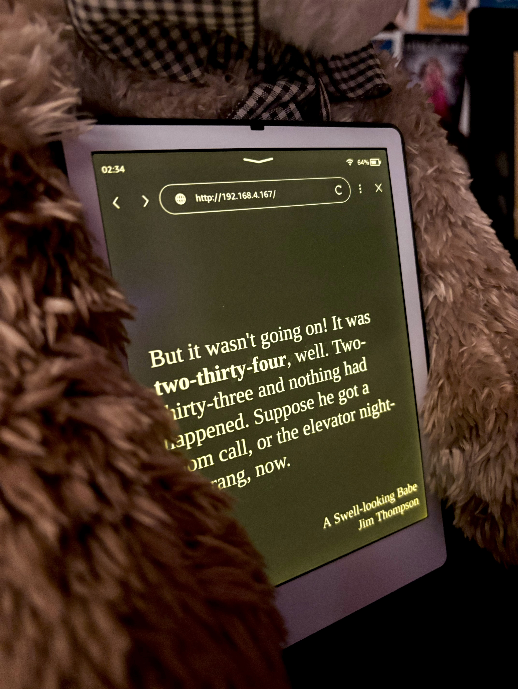

# Open Author Clock ⏰

An open-source, web-based implementation of the Author Clock Kickstarter project, intended to run in a web browser.

## ✨ See It in Action ✨

Why confine the words of literature to pages of a book? This project brings literary quotes to every minute of your day, telling time through the words of authors from times gone by.



Try it out for yourself: **[Live Demo Site 🖥️](https://clock.ambercaravalho.com)**

### Inspiration

This project was sparked by two main projects:

- [The Author Clock](https://www.authorclock.com): A dedicated gadget that tells time through literary quotes, offering a new hand-picked passage every minute.
- The [literaryclock repo](https://github.com/elegantalchemist/literaryclock) by [elegantalchemist](https://github.com/elegantalchemist): The idea of a literary clock already executed on the Kindle Keyboard using Python.


## Configuration

Edit [app/scripts/config.js](app/scripts/config.js):


| Setting                       | Default      | Purpose                                                 |
| ----------------------------- | ------------ | ------------------------------------------------------- |
| `fadeDuration`                | `1000`       | Crossfade length in milliseconds                        |
| `enableWakeLock`              | `true`       | Keep the screen awake while the clock is showing        |
| `timezoneOffsetHours`         | `null`       | Fixed UTC offset in hours; `null` uses the device clock |
| `minFontSize` / `maxFontSize` | `14` / `320` | Bounds for the quote text size, in pixels               |
| `debug`                       | `false`      | Log tick and text-fitting details to the console        |


Set `timezoneOffsetHours` only if the device has no timezone of its own, which is common on e-readers that report UTC. Everywhere else the default is correct.

### Query Parameters

Useful when setting up a display, and they override `config.js` for that session only:


| Parameter        | Effect                                                                    |
| ---------------- | ------------------------------------------------------------------------- |
| `?tz=-7`         | Force a UTC offset, e.g. `-7` for UTC-7                                   |
| `?quote=14:45`   | Pin the display to a given time instead of following the clock            |
| `?quote=longest` | Pin the display to the longest quote in the list, to check that text fits |
| `?debug`         | Turn on console logging                                                   |


### Text Sizing

The quote is measured and resized to the largest size that fits the screen, so it never scrolls or gets cut off no matter the quote length or display resolution. There is nothing to tune per device; `minFontSize` and `maxFontSize` only bound the search.

## Contributing to the Quote List

If you've stumbled upon a quote that perfectly captures a minute, feel free to contribute!

### Quote Formatting

Each quote is a JSON object in [app/data/quotes.json](app/data/quotes.json):

```json
{
  "time": "14:45",
  "timeString": "quarter to three",
  "quote": "The full sentence from the book where the time is mentioned.",
  "title": "Book Title",
  "author": "Author Name"
}
```

- **time**: The specific time the quote represents, in 24-hour format (e.g., `14:45`).
- **timeString**: The way the time is mentioned within the quote, to be highlighted (e.g., `quarter to three`).
- **quote**: The full sentence from the book where the time is mentioned.
- **title**: The title of the book the quote is from.
- **author**: The author of the book.

For example:

```json
{
  "time": "00:00",
  "timeString": "midnight",
  "quote": "It starts at midnight.",
  "title": "Catching Fire",
  "author": "Suzanne Collins"
}
```


### Where to Add Your Quote

1. Open [app/data/quotes.json](app/data/quotes.json)
2. Find the appropriate time slot (quotes are ordered by time)
3. Add your new quote object to the array
4. Ensure proper JSON formatting (don't forget commas between objects!)

Several quotes may share the same time; the clock picks among them at random, so adding one to a busy minute is never wasted. Minutes with no quote at all fall back to the nearest minute that has one.

## More Info


### Known Issues

Visit this repo's [Issues](https://github.com/ambercaravalho/open-author-clock/issues) page to see known issues and contribute to make this project even better!

### License Disclaimer

This project uses quotes sourced from the [literaryclock](https://github.com/elegantalchemist/literaryclock) repo under the GNU General Public License v3.0.

The bundled Tinos font is distributed under the SIL Open Font License 1.1. See [app/fonts/NOTICE.md](app/fonts/NOTICE.md).